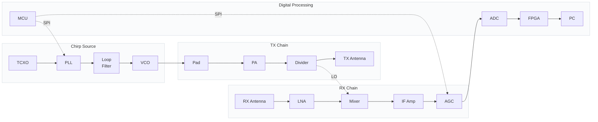

# FMCW Radar Front-End — 5.5–6 GHz (PLL + FPGA)

## Goal

Design and build a complete FMCW radar front-end at 5.5–6 GHz for **drone detection (counter-UAS)**. PLL-based chirp source (ADF41510 + YSGM556006 VCO), diode-ring mixer RX, dual 14-bit 250 MSPS ADC (AD9643), Xilinx Artix-7 XC7A100T FPGA for DSP, STM32H503 housekeeping MCU.

**Realistic prototype 1 targets:**
- ~2 km for small drones (σ = 0.01 m²) — with 64-chirp coherent integration
- ~3 km for medium drones (σ = 0.1 m²) — with coherent integration
- ~30 cm range resolution using 24 dBi antennas
- Scan rate 100 Hz to 10 kHz (configurable)
- Micro-Doppler drone/bird discrimination

---

## System Architecture

The radar is organised into **four functional blocks**: a PLL-based chirp source, a TX chain, an RX chain, and digital processing.



### Block summary

| Block | Function | Key parts |
|-------|----------|-----------|
| **Chirp Source** | Generates a linear 5.5–6 GHz chirp | ADF41510 PLL, YSGM556006 VCO, 100 MHz TCXO, loop filter |
| **TX Chain** | Amplifies and transmits the chirp | YG802020W PA (+15 dB), GP2X+ divider, 24 dBi antenna |
| **RX Chain** | Receives, amplifies, and downconverts echoes | QPL9547 LNA, YX18 mixer, OPA838 IF amp, MCP6S91 AGC, 24 dBi antenna |
| **Digital Processing** | Digitises and processes the IF signal | AD9643 ADC, XC7A100T FPGA, STM32H503 MCU |

### Signal flow

1. The **PLL** generates a linear frequency ramp (5.5–6 GHz) locked to a TCXO reference.
2. The **VCO output** splits: one path goes to the TX chain (amplified and radiated), the other to the mixer as the local oscillator.
3. **Target echoes** enter the RX chain, are amplified by the LNA, and mixed with the LO to produce a low-frequency IF beat note.
4. The IF signal is filtered, amplified, and digitised by the **ADC** at 250 MSPS.
5. The **FPGA** runs the DSP pipeline: DDC → decimation → FFT → 2D range-Doppler → detection.
6. The **MCU** configures the PLL, AGC, and temp sensor via SPI/I²C, and relays data to the PC via UART/USB.

---

## Confirmed BOM

| # | Part Number | Role | Qty | Key Specs |
|---|-------------|------|-----|-----------|
| 1 | **YSGM556006** (Innotion) | VCO (in PLL loop) | 1 | 5320–6060 MHz, +6 dBm, 0–5 V tune, 14 mA |
| 2 | **ADF41510** (ADI) | Fractional-N PLL | 1 | 1–10 GHz, −231 dBc/Hz PN, 250 MHz PFD, built-in ramp gen |
| 3 | **TCXO 100 MHz** (e.g., ECS-TXO-5032-100MHz) | PLL reference | 1 | 100 MHz, ±1 ppm, low phase noise |
| 4 | **Loop filter components** | Active op-amp + RC | 1 set | 100 kHz BW, 50° phase margin |
| 5 | **TMP102AIDRLR** (TI) | Temperature sensor (optional) | 1 | I²C, ±0.5 °C, SOT-563 |
| 6 | **YG802020W** (Innotion) | TX driver | 1 | +15 dB gain, P1dB ~+16 dBm @ 5.5 GHz |
| 7 | **GP2X+** (Mini-Circuits) | 2-way power divider | 1 | 2.9–6.2 GHz, 3.6 dB total loss |
| 8 | **QPL9547TR7** (Qorvo) | RX LNA | 1 | ~1 dB NF, ~10 dB gain at 5.75 GHz (verify) |
| 9 | **YX18** (Innotion) | Mixer diode quad | 1 | GaAs Schottky, 1.4 V turn-on |
| 10 | **NCS4-63+** (Mini-Circuits) | Mixer baluns | 2 | 4.5–6 GHz, 1:4 ratio |
| 11 | **OPA838IDBVR** (TI) | IF preamplifier | 1 | 0.9 nV/√Hz, 300 MHz GBW |
| 12 | **MCP6S91T-E/MS** (Microchip) | AGC (PGA) | 1 | 1×–32× (0–30 dB), 18 MHz GBW, SPI |
| 13 | **AD9643BCPZ-250** (ADI) | ADC | 1 | Dual 14-bit, 250 MSPS, LVDS, QFN-48 |
| 14 | **XC7A100T-CSG324** (Xilinx) | FPGA | 1 | Artix-7, 101K logic cells, 240 DSP slices |
| 15 | **MT41K256M16TW-107** (Micron) | DDR3L SDRAM | 1 | 256M × 16 = 512 MB |
| 16 | **STM32H503** (ST) | Housekeeping MCU | 1 | Cortex-M33 @ 250 MHz, 128 KB SRAM, USB |
| 17 | **ADP150AUJZ-5.0** (ADI) | Ultra-low noise LDO | 1 | 5 V for VCO |
| 18 | **LTM4644** (ADI) | FPGA power module | 1 | Multi-rail DC/DC (1.0/1.8/3.3 V) |
| 19 | **LD1117S33** | 3.3 V LDO | 1 | MCU, ADC digital |
| 20 | Resistors: 150 Ω, **37.4 Ω**, 150 Ω | 6 dB π-pad (corrected) | 3 | 0603 thin-film |
| 21 | Resistors: 1 kΩ, 9.09 kΩ | OPA838 gain (×10) | 2 | 0603, E96 |
| 22 | Caps, inductors, passives | Bypass, DC block, LPF, matching | ~20 | 0603/0805 |
| 23 | Antennas: **24 dBi** ×2 | TX and RX | 2 | 5.5–6 GHz |

**Removed (replaced by PLL):**
- ~~DAC8830IDR~~ (PLL generates the ramp)
- ~~REF5050AIDGKR~~ (PLL uses TCXO reference)
- ~~TLV9062IDR~~ (no DAC output to buffer)

**Total component cost: ~$150 (custom PCB) or ~$250 (Arty A7-100T + parts)**

---

## Signal Chain

### TX Path

```
YSGM556006 VCO (PLL-locked, +6 dBm)
    │
  6 dB π-pad (150/37.4/150) → 0 dBm
    │
  YG802020W (G=+15 dB @ 93 mA) → +15 dBm
    │
  GP2X+ divider (−3.6 dB) → +11.4 dBm per port
    │
    ├── Port 1 → TX antenna (24 dBi) → +35.4 dBm EIRP (3.5 W)
    │
    └── Port 2 → NCS4-63+ balun → YX18 mixer LO port
```

### RX Path

```
RX antenna (24 dBi) — target echoes: −107 to −159 dBm
    │
  QPL9547TR7 LNA (G=~10 dB, NF=~1 dB at 5.75 GHz)
    │
  NCS4-63+ balun (RF port, −0.5 dB)
    │
  YX18 diode mixer (−7 dB conversion loss, LO=+11.4 dBm)
    │
  RC LPF (1 kΩ + 33 pF, fc ≈ 4.8 MHz)
    │
  OPA838IDBVR (G=×10 = +20 dB, 300 MHz GBW)
    │
  MCP6S91T-E/MS (G=1×–32× = 0–30 dB, SPI AGC)
    │
  AD9643BCPZ-250 ch A (14-bit, 250 MSPS, LVDS)
    │
  XC7A100T ISERDES → DDC → decimate → window → FFT → 2D FFT → MTI → CFAR
    │
  USB/UART output (detected targets, range-Doppler maps)
```

### Chirp Source — ADF41510 PLL Detail

```
                          ┌─────────────────────────┐
                          │      ADF41510            │
                          │   (fractional-N PLL)    │
  TCXO 100 MHz ──────────►│  REF_IN                  │
                          │                         │
  STM32H503 SPI ────────►│  LE, CLK, DATA          │
  (ramp parameters)       │  (ramp start, stop,     │
                          │   step, time, mode)     │
                          │                         │
                          │  PFD ──────────────────►│──► Loop filter
                          │                         │     (active op-amp)
                          │  CP ───────────────────┘            │
                          │                                     ▼
                          │                            YSGM556006 VCO
                          │                            (tuning pin VT)
                          │                                    │
                          │  RF input ◄────────────────────────┘
                          │  (prescaler ÷M, 1-10 GHz)
                          └─────────────────────────┘
                                      │
                                      ▼
                              5.5–6 GHz OUT
                          (phase-locked, low noise)
```

### FPGA and MCU Division

| Function | Component | Notes |
|----------|-----------|-------|
| Chirp generation | **ADF41510** built-in ramp gen | Sawtooth or triangular, configurable |
| ADF41510 config | **STM32H503** SPI | Ramp parameters, mode selection |
| AGC control (MCP6S91) | **STM32H503** SPI | One SPI write per chirp |
| Temperature monitoring | **STM32H503** I2C → TMP102 | Optional (PLL eliminates drift) |
| ADC interface | **XC7A100T** ISERDES (LVDS) | 14-bit @ 250 MSPS, DDR |
| DDC + decimation | **XC7A100T** CORDIC + CIC + FIR | 250 MSPS → 3.9 MSPS |
| Range FFT | **XC7A100T** Xilinx FFT IP | 1024-pt, < 1 µs latency |
| Doppler FFT (2D) | **XC7A100T** | 64-pt across chirps |
| MTI, CFAR, detection | **XC7A100T** | Hardware, deterministic |
| Micro-Doppler | **XC7A100T** | High-PRF mode (10 kHz) |
| Tracking, output | **XC7A100T** | Kalman filter, USB/UART |
| Debug / config | **STM32H503** UART | Mode switching, ADF41510 reconfig |

---

## FPGA DSP Pipeline (Detailed)

```
                ┌─────────────────────────────────────────────────────────────┐
                │                   ONE CHIRP PROCESSING                        │
                │                                                              │
  AD9643 ch A ─► ISERDES: 250 MSPS × 14-bit LVDS → 8-bit @ 31.25 MHz words │
                       │                                                        │
                       ▼                                                        │
  DDC: complex mixer ─► CORDIC (mix with NCO) ─► decimate 4× → 62.5 MSPS  │
                       │                                                        │
                       ▼                                                        │
  Decimate: CIC (4×) + FIR (4×) ─► 3.9 MSPS (filter, anti-alias)          │
                       │                                                        │
                       ▼                                                        │
  Window: Hann/Blackman (multiply sample-by-sample)                        │
                       │                                                        │
                       ▼                                                        │
  FFT: 1024-pt complex, streaming pipelined ─► |X[k]|² magnitudes         │
                       │                                                        │
                       ▼                                                        │
  Buffer: store 64 range profiles in DDR (64 × 1024 × 4 bytes = 256 KB)    │
                       │                                                        │
                       ▼                                                        │
  2nd FFT: across 64 chirps at each range bin ─► Doppler spectrum          │
                       │                                                        │
                       ▼                                                        │
  MTI: subtract consecutive Doppler maps ─► reject stationary clutter     │
                       │                                                        │
                       ▼                                                        │
  CFAR: cell-averaging CA-CFAR on range-Doppler map                        │
                       │                                                        │
                       ▼                                                        │
  Detection: peak find → range, velocity, amplitude, micro-Doppler feat.   │
                       │                                                        │
                       ▼                                                        │
  Tracking: Kalman filter across frames → track ID, trajectory              │
                       │                                                        │
                       ▼                                                        │
  Output: UART/USB → list of detected targets with metadata               │
                └─────────────────────────────────────────────────────────────┘
```

### FPGA Resource Estimate (XC7A100T)

| Block | LUTs | DSP48 | BRAM (KB) |
|-------|------|-------|-----------|
| ISERDES + clocking | 2,000 | 0 | 0 |
| DDC (CORDIC + NCO) | 1,500 | 16 | 4 |
| Decimation CIC+FIR | 1,000 | 24 | 32 |
| Window function | 500 | 4 | 0 |
| FFT 1024-pt (1 channel) | 3,000 | 20 | 32 |
| 2D FFT buffer (DDR ctrl) | 1,500 | 0 | 256 (DDR) |
| MTI / CFAR | 2,000 | 8 | 64 |
| Tracking | 1,000 | 4 | 8 |
| **Total** | **~12,500 (20%)** | **~76 (32%)** | **~132 (3% of 4,860 KB)** |

The XC7A100T easily handles two channels (I/Q) simultaneously.

---

## PLL Design Details

### ADF41510 Key Parameters

| Parameter | Value | Notes |
|-----------|-------|-------|
| RF input range | 1–10 GHz | Covers 5.5–6 GHz with margin |
| PFD frequency | Up to 250 MHz (int), 125 MHz (frac) | |
| Phase noise (frac-N) | **−231 dBc/Hz** | At 100 kHz offset (datasheet) |
| Fractional modulus | 25-bit fixed, 49-bit variable | |
| Charge pump current | 16 programmable settings | 0.5–7.5 mA typical |
| Ramp generator | Built-in (sawtooth, triangular) | |
| SPI clock | Up to 50 MHz | |
| Supply | 3.3 V | |

### Loop Filter Design

Use ADI's ADIsimPLL tool to design the loop filter. Starting point:

| Parameter | Value | Notes |
|-----------|-------|-------|
| Reference frequency | 100 MHz (TCXO) | |
| PFD frequency | 100 MHz (1× ref) | |
| VCO frequency | 5.5–6.0 GHz | |
| VCO Kv | ~150 MHz/V (typical) | From YSGM556006 datasheet |
| Loop bandwidth | **100 kHz** (search/track) | 10× the chirp rate |
| Phase margin | **50°** | |
| Charge pump current | 2.5 mA (medium) | |
| Loop filter topology | Active (op-amp) | Better than passive for wide BW |

**Loop BW vs chirp rate:**

| Mode | Chirp rate | Required loop BW | Achievable? |
|------|------------|-----------------|-------------|
| Search (10 ms ramp) | 100 Hz | 1 kHz | ✅ |
| Track (5 ms ramp) | 200 Hz | 2 kHz | ✅ |
| Fast (1 ms ramp) | 1 kHz | 10 kHz | ✅ |
| Micro-Doppler (0.1 ms ramp) | 10 kHz | 100 kHz | ✅ (wider loop needed) |

**Programmable loop BW:** Use a switched capacitor array (GPIO-controlled) to switch loop filter components between modes. Or use two separate loop filters (one for narrow-BW modes, one for micro-Doppler).

### Ramp Configuration

The ADF41510's ramp generator produces:
- **Sawtooth**: f_start → f_stop over T_ramp, then snap back to f_start
- **Triangular**: f_start → f_stop → f_start, each over T_ramp/2

STM32H503 configures the ramp via SPI:
- Start frequency (e.g., 5.5 GHz)
- Stop frequency (e.g., 6.0 GHz)
- Step size (e.g., 100 kHz for 5000 steps over 500 MHz)
- Dwell time per step (e.g., 2 µs for 1 ms ramp with 500 steps)
- Ramp mode (sawtooth or triangular)
- Trigger source (internal or external)

---

## Power Budgets

### TX Power Budget

| Stage | Level | Notes |
|-------|-------|-------|
| PLL-locked VCO | +6 dBm | YSGM556006 in PLL loop |
| 6 dB π-pad | −6 dB | |
| YG802020W | +15 dB | 1 dB below P1dB |
| GP2X+ | −3.6 dB | |
| **Each port** | **+11.4 dBm** | |
| With 24 dBi TX | **+35.4 dBm EIRP** (3.5 W) | Not ISM |

### RX Link Budget — Drone Detection (with coherent integration)

Conditions: Pt = +11.4 dBm, Gt = Gr = 24 dBi, NF = 1 dB, noise floor = −143 dBm (1 kHz bin).

| Range | σ (m²) | Target | Pr (dBm) | SNR (1 chirp) | SNR (64-chirp coherent) |
|-------|--------|--------|----------|----------------|------------------------|
| 500 m | 0.1 | Medium drone | −117.2 | 26 dB | **44 dB** ✅ |
| 500 m | 0.01 | Small drone | −127.2 | 16 dB | **34 dB** ✅ |
| 1 km | 0.1 | Medium drone | −129.2 | 14 dB | **32 dB** ✅ |
| 1 km | 0.01 | Small drone | −139.2 | 4 dB | **22 dB** ✅ |
| 1.5 km | 0.1 | Medium drone | −136.2 | 7 dB | **25 dB** ✅ |
| 1.5 km | 0.01 | Small drone | −146.2 | −3 dB | **15 dB** ✅ |
| 2 km | 0.1 | Medium drone | −141.2 | 2 dB | **20 dB** ✅ |
| 2 km | 0.01 | Small drone | −151.2 | −8 dB | **10 dB** ⚠️ |
| 3 km | 0.1 | Medium drone | −148.7 | −6 dB | **12 dB** ⚠️ |

**With coherent integration (PLL + FPGA):** 2 km small drone detection is achievable. 3 km medium drone is marginal.

**Phase noise bonus:** ADF41510's −231 dBc/Hz at 100 kHz is much better than the free-running VCO. This reduces phase noise masking of small targets, potentially adding another 3–5 dB of effective sensitivity.

---

## Chirp Configurations

| Mode | Ramp T | LPF fc | Max range | f_IF @ max | ADC rate (after decimate) | FFT | Scan rate | v_max |
|------|--------|--------|-----------|------------|--------------------------|-----|-----------|-------|
| **Search** | 10 ms | 500 kHz | 1.5 km | 500 kHz | 3.9 MSPS | 4096-pt | 100 Hz | 0.625 m/s |
| **Track** | 5 ms | 1 MHz | 1.5 km | 1 MHz | 7.8 MSPS | 2048-pt | 200 Hz | 1.25 m/s |
| **Fast** | 1 ms | 5 MHz | 500 m | 1.67 MHz | 31.25 MSPS | 512-pt | 1 kHz | 6.25 m/s |
| **Micro-Doppler** | 0.1 ms | 5 MHz | 50 m | 1.67 MHz | 250 MSPS | 256-pt | 10 kHz | 62.5 m/s |

**Note on PLL loop BW:** The PLL loop BW must be > 10× the chirp rate. At 10 ms ramp, 1 kHz loop BW is fine. At 0.1 ms micro-Doppler, need 100 kHz loop BW. Use a programmable loop filter (switched capacitor array) for different modes.

---

## Key Design Decisions

1. **ADF41510 PLL (not open-loop DAC)** — built-in ramp generator, ultra-low phase noise, true chirp-to-chirp coherence. Replaces DAC8830 + REF5050A + TLV9062.
2. **YSGM556006 as PLL VCO** — reused from existing stock. Becomes the VCO in the PLL loop.
3. **XC7A100T FPGA** — all real-time DSP. Replaces the MCU approach. Enables coherent integration (+18 dB), micro-Doppler, 2D range-Doppler.
4. **AD9643 at 250 MSPS** — dual 14-bit LVDS. Ch A for IF, Ch B for future I/Q.
5. **STM32H503 housekeeping MCU** — ADF41510 config, MCP6S91 AGC, TMP102 temp monitoring, USB. Modern Cortex-M33 at 250 MHz.
6. **TCXO 100 MHz reference** — PLL reference. Low phase noise, ±1 ppm.
7. **Open-loop DAC ramp removed** — PLL generates the ramp. No more LUT pre-distortion, no more temperature compensation needed.
8. **Single YG802020W before GP2X+ divider** — P1dB ~+16 dBm at 5.5 GHz, output +15 dBm.
9. **GP2X+ divider** — 3.6 dB loss, 20 dB isolation.
10. **QPL9547 as LNA** — ~1 dB NF, ~10 dB gain at 5.75 GHz (verify).
11. **YX18 + 2× NCS4-63+ as mixer** — 1:4 balun provides voltage step-up.
12. **OPA838 ×10 fixed gain (300 MHz GBW)** — 20 dB gain, 30 MHz bandwidth.
13. **MCP6S91 SPI AGC (0–30 dB)** — gain control. At ×32, BW=562 kHz.
14. **Separate TX/RX antennas (24 dBi)** — no circulator.
15. **Single IF channel for prototype 1** — Ch A only. Ch B ready for I/Q.
16. **Configurable ramp time** — 10 ms search, 1 ms track, 0.1 ms micro-Doppler.
17. **IF LPF: 1 kΩ + 33 pF (fc ≈ 4.8 MHz)** — passes full IF range for all modes.

---

## Implementation Tasks

### Phase 0: Documentation

- [x] Update Lyrion-Radar README.md with Mermaid diagram, STM32H503, professional layout
- [x] Update PLAN.md with same changes

### Phase 1: Hardware Bring-Up

- [ ] Acquire XC7A100T dev board (Digilent Arty A7-100T) or design custom PCB
- [ ] Acquire AD9643BCPZ-250 (or use evaluation board)
- [ ] Acquire ADF41510 (or use EVAL-ADF41510)
- [ ] Acquire 100 MHz TCXO
- [ ] Acquire STM32H503 dev board
- [ ] Acquire DDR3L SDRAM
- [ ] LTM4644 power module for FPGA rails
- [ ] Verify all other parts from BOM are in hand

### Phase 2: PLL Chirp Source

- [ ] Design loop filter (ADIsimPLL tool) — 100 kHz BW, 50° phase margin
- [ ] Solder ADF41510, loop filter, YSGM556006 VCO
- [ ] Power up, verify PLL locks at 5.75 GHz
- [ ] Configure ramp via SPI: 5.5 → 6.0 GHz, 1 ms sawtooth
- [ ] Measure ramp linearity on spectrum analyzer
- [ ] Measure phase noise at 100 kHz offset (target: ~−200 dBc/Hz or better)
- [ ] Test all modes: Search (10 ms), Track (5 ms), Fast (1 ms), Micro-Doppler (0.1 ms)
- [ ] Measure TX output: +6 dBm at VCO, +15 dBm after YG802020W

### Phase 3: TX Chain

- [ ] Solder 6 dB π-pad (150/37.4/150 Ω)
- [ ] Solder YG802020W with EVB-03 matching
- [ ] Solder GP2X+ divider
- [ ] Verify +11.4 dBm on both output ports
- [ ] Connect TX antenna (24 dBi), verify radiation pattern

### Phase 4: RX Chain + Mixer

- [ ] Measure QPL9547 NF and gain at 5.75 GHz
- [ ] Solder QPL9547 LNA
- [ ] Build YX18 mixer with 2× NCS4-63+ baluns
- [ ] Solder RC LPF (1 kΩ + 33 pF, fc ≈ 4.8 MHz)
- [ ] Solder OPA838 (G=×10)
- [ ] Solder MCP6S91 (SPI from STM32H503)
- [ ] Verify mixer conversion loss with two signal generators

### Phase 5: FPGA Firmware (VHDL/Verilog in Vivado)

- [ ] Vivado project for XC7A100T-CSG324
- [ ] Clock generation: 250 MHz ADC clock, 100 MHz fabric clock, 200 MHz DDR clock
- [ ] ISERDES: 14-bit LVDS deserialization from AD9643
- [ ] AD9643 SPI config (sample rate, output format, channel select)
- [ ] DDC: CORDIC + NCO for complex downconversion
- [ ] Decimation: CIC (4×) + FIR (4×) → 3.9 MSPS
- [ ] Window function (Hann)
- [ ] FFT: Xilinx FFT IP, 1024-pt complex, pipelined streaming
- [ ] DDR3 controller (Xilinx MIG) for FFT buffer storage
- [ ] 2D FFT: 64-pt across chirps at each range bin
- [ ] MTI: subtract consecutive Doppler maps
- [ ] CFAR: cell-averaging on range-Doppler map
- [ ] Peak detection
- [ ] Micro-Doppler mode (high-PRF, 0.1 ms ramps)
- [ ] Tracking: Kalman filter across frames
- [ ] UART output: detected targets with range, velocity, amplitude

### Phase 6: MCU Firmware (STM32H503)

- [ ] CubeMX project for STM32H503
- [ ] SPI1 → ADF41510 (ramp configuration, RAMP_START trigger)
- [ ] SPI2 → MCP6S91 (AGC gain control)
- [ ] I2C1 → TMP102 (temperature monitoring)
- [ ] GPIO → FPGA mode/control
- [ ] UART → debug / config interface
- [ ] Ramp state machine (triggered by FPGA sync signal)

### Phase 7: Integration + Validation

- [ ] End-to-end test: place target at 100 m, 500 m, 1 km
- [ ] Measure range accuracy and resolution
- [ ] Test AGC convergence
- [ ] Measure coherent integration gain (1 vs 64 chirps) — should be +18 dB
- [ ] Test micro-Doppler mode with a spinning fan or drone propeller
- [ ] Thermal test: verify TMP102 (monitoring only, PLL should be stable)
- [ ] Measure TX leakage into RX
- [ ] Drone detection test: fly a small drone at 500 m, 1 km, 2 km
- [ ] Bird vs. drone discrimination test (micro-Doppler mode)

---

## PCB Layout Guidelines

### ADF41510 PLL Section

- **Loop filter**: close to ADF41510 charge pump output, short traces
- **YSGM556006 VCO**: close to loop filter output, short VT trace (parasitic capacitance degrades loop phase margin)
- **TCXO reference**: clean supply, short trace to ADF41510 REF_IN
- **SPI**: short traces to STM32H503, with proper grounding

### ADC (AD9643) to FPGA Interface

- **LVDS pairs**: matched-length (±0.5 mm) within each byte group
- **Differential impedance**: 100 Ω differential
- **Trace length**: keep < 50 mm total
- **AC coupling**: 100 nF caps on each LVDS pair
- **Reference plane**: solid ground under all LVDS traces
- **ADC clock**: clean 250 MHz from FPGA MMCM

### FPGA (XC7A100T-CSG324) BGA Layout

- **BGA pitch**: 0.8 mm, 324 balls
- **Fanout**: dog-bone or via-in-pad
- **Layer count**: 8+ layers for signal integrity
- **DDR3**: Fly-by topology, matched-length ±25 ps
- **Power**: multiple decoupling caps per rail
- **JTAG**: standard Xilinx programming header

### RF Section (5.5–6 GHz)

- **50 Ω microstrip**: ~3 mm wide on 1.6 mm FR4
- **VCO placement**: keep 6 dB π-pad within 2 mm of VCO output
- **Mixer**: NCS4-63+ baluns as close as possible to YX18
- **Ground**: solid ground plane, multiple vias

### Development Board Option (Digilent Arty A7-100T)

The Arty A7-100T dev board includes:
- XC7A100T-CSG324
- 256 MB DDR3L (MT41K256M16TW-107)
- USB-UART bridge
- 4 PMOD connectors (for ADC interface board)
- Onboard clock (can be replaced with 250 MHz from ADC eval board)

This is the **recommended starting point** for prototype 1. Custom PCB is a later step.

---

## Risks and Mitigations

| Risk | Impact | Mitigation |
|------|--------|-----------|
| **PLL loop BW vs chirp rate** | PLL can't track fast ramps | Use 100 kHz loop BW for search, switch to 500 kHz for micro-Doppler (programmable filter) |
| **PLL loop filter design** | Critical for stability and phase noise | Use ADI ADIsimPLL tool, verify with spectrum analyzer |
| **Fractional-N spurs** | Spurs at PFD/2, etc. | Use dithering mode or integer-N for cleanest spectrum |
| **VCO tuning non-linearity** | Residual non-linearity even with PLL | ADF41510 ramp generator compensates; measure to confirm |
| YX18 mixer conversion loss higher than 7 dB at 5.5 GHz | Reduced sensitivity | Measure on EVB first; increase LO drive if needed |
| TX-RX antenna coupling saturates LNA | Blind zone at close range | Maximize antenna separation; QPL9547 P1dB = +19 dBm handles leakage |
| YG802020W P1dB only +16 dBm at 5.5 GHz | TX power limited to +15 dBm | Add MMG3H21NT1 PA in rev 2 for +27 dBm |
| AD9643 LVDS timing at 250 MSPS | Data corruption | Matched-length pairs, AC coupling, verified with logic analyzer |
| FPGA BGA PCB complexity | Expensive, hard to assemble | **Start with Arty A7-100T dev board** |
| DDR3 signal integrity | Memory errors | Fly-by topology, matched-length, proper termination |
| **QPL9547 NF at 5.75 GHz unverified** | System NF may be 1.5–2 dB | Measure on NF meter; add 2 dB margin |
| **v_max at 10 ms = 0.625 m/s** | Drones alias | Use Fast or Micro-Doppler mode for moving drones |
| **+35 dBm EIRP not ISM** | Regulatory | Acquire experimental/STA license |
| **FR4 at 5.5–6 GHz** | Higher loss, εr tolerance | Acceptable for prototype; Rogers for production |

---

## Open Questions (resolve during implementation)

- **PLL loop filter topology**: Active vs passive, component values (use ADIsimPLL)
- **PLL reference frequency**: 100 MHz TCXO vs other (affects PFD frequency and spur locations)
- **Loop BW for each mode**: Search (1 kHz?), Track (10 kHz?), Micro-Doppler (100 kHz?)
- **QPL9547 NF/gain at 5.75 GHz**: MUST measure on noise-figure meter
- **Antenna type**: 8×8 patch array (~30×30 cm) or parabolic dish (~40 cm)
- **AD9643 input range**: 2 Vpp or 3.5 Vpp
- **FPGA development**: start with Arty A7-100T or custom PCB?
- **DDR3 size**: 256 MB sufficient for 64-chirp × 4096-pt × 2 channels?
- **Future**: PA upgrade (MMG3H21NT1), I/Q upgrade (90° hybrid + 2nd mixer), MIMO with multiple antennas
