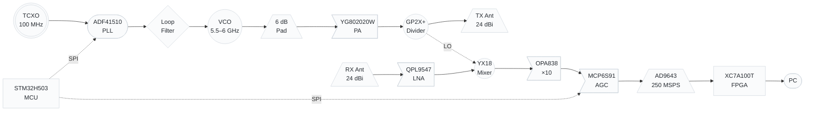
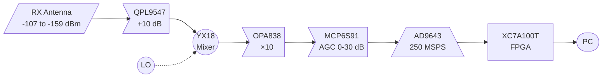
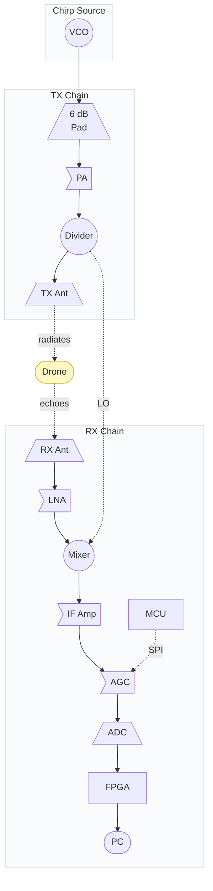

<p align="center">
  <h1 align="center">Lyrion Radar</h1>
  <p align="center">
    <strong>FMCW Radar for Counter-UAS (Drone Detection)</strong><br>
    5.5–6 GHz · 30 cm range resolution · 2–3 km detection range
  </p>
</p>

<p align="center">
  <a href="#what-is-it"></a>
  <a href="#components"></a>
  <a href="#link-budget"></a>
  <a href="#license"></a>
</p>

---

## Table of Contents

- [What is it?](#what-is-it)
- [Key Features](#key-features)
- [System Overview](#system-overview)
- [How it Works](#how-it-works)
- [Components](#components)
- [Signal Chain](#signal-chain)
- [Link Budget](#link-budget)
- [Chirp Modes](#chirp-modes)
- [Why PLL + FPGA?](#why-pll--fpga)
- [Design Decisions](#design-decisions)
- [Status & Roadmap](#status--roadmap)
- [Known Limitations](#known-limitations)
- [License](#license)

---

## What is it?

Lyrion Radar is a **Frequency-Modulated Continuous-Wave (FMCW) radar** designed to detect small drones (DJI Phantom class and larger) at ranges of 2–3 km. It uses a **fractional-N PLL for chirp generation**, a **Xilinx Artix-7 FPGA for real-time signal processing**, and a **14-bit 250 MSPS ADC** for IF digitization.

The design is built around a **phase-locked loop** (not an open-loop DAC) for chirp coherence, and an **FPGA** (not a microcontroller) for the real-time DSP pipeline. This enables:

- **True coherent integration** across 64+ chirps (+18 dB SNR)
- **Micro-Doppler analysis** (drone rotor blade modulation at 100–500 Hz)
- **2D range-Doppler maps** in real-time
- **Deterministic latency** for tracking

---

## Key Features

| Feature | Specification |
|---------|---------------|
| **Frequency band** | 5.5 – 6.0 GHz (500 MHz sweep) |
| **Range resolution** | 30 cm |
| **Max range (small drone, σ=0.01 m²)** | ~2 km |
| **Max range (medium drone, σ=0.1 m²)** | ~3 km |
| **Chirp source** | ADF41510 fractional-N PLL (built-in ramp gen) |
| **Phase noise** | −231 dBc/Hz @ 100 kHz (fractional-N) |
| **ADC** | AD9643 dual 14-bit, 250 MSPS (LVDS) |
| **DSP** | Xilinx XC7A100T Artix-7 FPGA |
| **TX power** | +11.4 dBm (prototype 1) |
| **Antenna gain** | 24 dBi each (TX and RX, separate) |
| **EIRP** | +35.4 dBm (3.5 W ERP) |
| **Scan rate** | 100 Hz – 10 kHz (configurable) |
| **BOM cost** | ~$250 (with Arty A7-100T dev board) |

---

## System Overview

The radar is organised into **four functional blocks**: a PLL-based chirp source, a TX chain, an RX chain, and digital processing.



**Shape legend** (standard RF block diagram conventions):

| Shape | Used for | Examples |
|-------|----------|----------|
| Trapezoid | Antenna, filter, pad | TX Ant, RX Ant, 6 dB pad |
| Flag/triangle | Amplifier | YG802020W PA, QPL9547 LNA, OPA838, MCP6S91 |
| Circle | Mixer, divider, VCO, reference | YX18 mixer, GP2X+ divider, VCO, TCXO |
| Stadium | PLL, FPGA, MCU, PC | ADF41510, XC7A100T, STM32H503, PC display |
| Diamond | Filter | Loop filter |
| Parallelogram | ADC | AD9643 |

### Block summary

| Block | Function | Key parts |
|-------|----------|-----------|
| **Chirp Source** | Generates a linear 5.5–6 GHz chirp | ADF41510 PLL, YSGM556006 VCO, 100 MHz TCXO, loop filter |
| **TX Chain** | Amplifies and transmits the chirp | YG802020W PA (+15 dB), GP2X+ divider, 24 dBi antenna |
| **RX Chain** | Receives, amplifies, and downconverts echoes | QPL9547 LNA, YX18 mixer, OPA838 IF amp, MCP6S91 AGC, 24 dBi antenna |
| **Digital Processing** | Digitises and processes the IF signal | AD9643 ADC, XC7A100T FPGA, STM32H503 MCU |

### Signal flow

1. The **PLL** generates a linear frequency ramp (5.5–6 GHz) locked to a TCXO reference.
2. The **VCO output** splits: one path goes to the TX chain (amplified and radiated), the other to the mixer as the local oscillator.
3. **Target echoes** enter the RX chain, are amplified by the LNA, and mixed with the LO to produce a low-frequency IF beat note.
4. The IF signal is filtered, amplified, and digitised by the **ADC** at 250 MSPS.
5. The **FPGA** runs the DSP pipeline: DDC → decimation → FFT → 2D range-Doppler → detection.
6. The **MCU** configures the PLL, AGC, and temp sensor via SPI/I²C, and relays data to the PC via UART/USB.

---

## How it Works

### FMCW Principle

The radar transmits a signal whose **frequency sweeps linearly over time** (a "chirp"). The signal reflects off a target and returns after a time delay `τ = 2R/c`. Mixing the received signal with the current transmit signal produces a **beat frequency** directly proportional to target range:

```
f_IF = (2 · B · R) / (c · T)
```

Where:
- **B** = sweep bandwidth (500 MHz)
- **R** = target range
- **c** = speed of light
- **T** = ramp time (1–10 ms)

An **FFT** of this beat signal reveals targets as distinct frequency peaks. A **triangular ramp** (up-chirp + down-chirp) extracts both range and velocity.

### Signal Flow

1. **PLL generates chirp** (5.5–6 GHz, linear ramp)
2. **TX chain** amplifies and splits the signal to the TX antenna and the mixer LO
3. **RX chain** amplifies echoes (LNA), downconverts (mixer), filters (LPF), and digitizes (ADC)
4. **FPGA** processes the IF signal: DDC → decimate → FFT → 2D FFT → detection
5. **MCU** handles housekeeping: PLL config, AGC, temperature, USB
6. **PC** displays the range-Doppler map and detected targets

---

## Components

### Chirp Source

| Part | Manufacturer | Role | Key Specs |
|------|-------------|------|-----------|
| **YSGM556006** | Innotion | VCO (in PLL loop) | 5320–6060 MHz, +6 dBm, 0–5 V tune |
| **ADF41510** | Analog Devices | Fractional-N PLL | 1–10 GHz, −231 dBc/Hz, built-in ramp gen |
| **TCXO 100 MHz** | ECS Inc | PLL reference | ±1 ppm, low phase noise |

### Analog Front-End

| Part | Manufacturer | Role | Key Specs |
|------|-------------|------|-----------|
| **YG802020W** | Innotion | TX driver | +15 dB gain, P1dB +16 dBm @ 5.5 GHz |
| **GP2X+** | Mini-Circuits | 2-way divider | 2.9–6.2 GHz, 3.6 dB loss, 20 dB isolation |
| **QPL9547TR7** | Qorvo | RX LNA | ~1 dB NF, ~10 dB gain at 5.75 GHz |
| **YX18** | Innotion | Mixer diode quad | GaAs Schottky, 1.4 V turn-on |
| **NCS4-63+** (×2) | Mini-Circuits | Baluns | 4.5–6 GHz, 1:4 impedance ratio |
| **OPA838IDBVR** | TI | IF preamplifier | 0.9 nV/√Hz, 300 MHz GBW |
| **MCP6S91T-E/MS** | Microchip | AGC (PGA) | 1×–32× gain, 18 MHz GBW, SPI |

### Digital Processing

| Part | Manufacturer | Role | Key Specs |
|------|-------------|------|-----------|
| **AD9643BCPZ-250** | ADI | ADC | Dual 14-bit, 250 MSPS, LVDS |
| **XC7A100T-CSG324** | Xilinx | FPGA | Artix-7, 101K logic cells, 240 DSP slices |
| **MT41K256M16TW-107** | Micron | DDR3L SDRAM | 256M × 16 = 512 MB |
| **STM32H503** | ST | Housekeeping MCU | Cortex-M33 @ 250 MHz, 128 KB SRAM, USB |

> The **STM32H503** is the right fit for housekeeping: faster and more capable than the STM32G071, but not overkill like the STM32H723. It handles SPI to the PLL, SPI to the AGC, I²C to the temp sensor, GPIO to the FPGA, and USB for debugging.

### Power

| Part | Manufacturer | Role | Key Specs |
|------|-------------|------|-----------|
| **ADP150AUJZ-5.0** | ADI | Ultra-low noise LDO | 5 V, <10 µVrms, for VCO |
| **LTM4644** | ADI | FPGA power module | Multi-rail DC/DC (1.0/1.8/3.3 V) |
| **LD1117S33** | ST | 3.3 V LDO | MCU, ADC digital |

### Antennas

| Item | Spec | Size | Notes |
|------|------|------|-------|
| TX antenna | 24 dBi, 5.5–6 GHz | ~30×30 cm patch or 40 cm dish | Separate from RX |
| RX antenna | 24 dBi, 5.5–6 GHz | Same | Same direction as TX |

**Total BOM cost: ~$250** (including Arty A7-100T dev board)

---

## Signal Chain

The signal chain is shown in three views: **TX path** (chirp → antenna), **RX path** (antenna → digital), and **Complete path** (TX + RX with the mixer connection between them).

### TX Path


### RX Path



### Complete Path (TX + RX)



---

## Link Budget

Conditions: TX power +11.4 dBm, antenna gain 24 dBi each, system NF ~1 dB, noise floor −143 dBm per 1 kHz bin.

| Range | RCS | Target type | SNR (1 chirp) | **SNR (64-chirp coherent)** |
|-------|-----|-------------|----------------|------------------------------|
| 500 m | 0.1 m² | Medium drone | 26 dB | **44 dB** ✅ |
| 500 m | 0.01 m² | Small drone | 16 dB | **34 dB** ✅ |
| 1 km | 0.1 m² | Medium drone | 14 dB | **32 dB** ✅ |
| 1 km | 0.01 m² | Small drone | 4 dB | **22 dB** ✅ |
| 1.5 km | 0.1 m² | Medium drone | 7 dB | **25 dB** ✅ |
| 1.5 km | 0.01 m² | Small drone | −3 dB | **15 dB** ✅ |
| 2 km | 0.1 m² | Medium drone | 2 dB | **20 dB** ✅ |
| 2 km | 0.01 m² | Small drone | −8 dB | **10 dB** ⚠️ |
| 3 km | 0.1 m² | Medium drone | −6 dB | **12 dB** ⚠️ |

**Key advantage:** The PLL + FPGA enables **true coherent integration** (+18 dB for 64 chirps) vs. the ~+9 dB noncoherent limit of an open-loop MCU approach. This is what makes 2 km small-drone detection feasible without a power amplifier.

---

## Chirp Modes

The radar supports four configurable modes, switchable via SPI to the ADF41510:

| Mode | Ramp time | Max range | Scan rate | v_max | Use case |
|------|-----------|-----------|-----------|-------|----------|
| **Search** | 10 ms | 1.5 km | 100 Hz | 0.6 m/s | Long-range detection |
| **Track** | 5 ms | 1.5 km | 200 Hz | 1.25 m/s | Following a detected target |
| **Fast** | 1 ms | 500 m | 1 kHz | 6.25 m/s | Close-range, high speed |
| **Micro-Doppler** | 0.1 ms | 50 m | 10 kHz | 62.5 m/s | Drone vs. bird discrimination |

**Micro-Doppler mode** is the key discriminator: at 10 kHz chirp PRF, the FPGA can resolve 100–500 Hz rotor blade modulation, which is unique to drones.

---

## Why PLL + FPGA?

For serious drone detection, you need phase coherence, micro-Doppler processing, and low phase noise. Only a PLL + FPGA architecture delivers all three.

| Requirement | Open-loop DAC + MCU | **PLL + FPGA (this design)** |
|-------------|--------------------|-----------------------|
| Phase noise | ~−80 dBc/Hz (free VCO) | **−231 dBc/Hz** (fractional-N) |
| Chirp coherence | Unproven | **Proven** (PLL locks to TCXO) |
| Coherent integration | +9 dB (noncoherent) | **+18 dB** (coherent) |
| Micro-Doppler | Infeasible | **Trivial** (10 kHz PRF mode) |
| 2D range-Doppler | Slow (software) | **< 100 µs** (hardware FFT) |
| Temperature stability | Needs compensation | **Eliminated** (PLL locks) |
| Range (small drone) | ~1 km | **~2 km** |

---

## Design Decisions

### 1. ADF41510 PLL (not open-loop DAC)

The open-loop DAC approach was simpler but had critical limitations: VCO phase noise masks small targets, chirp coherence was unproven, and temperature drift needed active compensation. The ADF41510 solves all of these with a built-in ramp generator, ultra-low phase noise, and PLL locking to a stable TCXO reference.

### 2. XC7A100T FPGA (not MCU)

A microcontroller can do basic range FFT in ~50 µs, but cannot do real-time coherent integration, micro-Doppler, or 2D range-Doppler processing. The XC7A100T runs FFTs in < 1 µs in hardware, with deterministic latency.

### 3. AD9643 at 250 MSPS (not slower)

250 MSPS provides ample oversampling for the FPGA's DDC + decimation pipeline. The dual channel is ready for future I/Q expansion.

### 4. YSGM556006 as PLL VCO

The VCO you already own is reused as the VCO in the PLL loop. The ADF41510 doesn't have an integrated VCO, so this is a natural fit.

### 5. STM32H503 for housekeeping (not G071, not H723)

The G071 would technically work for housekeeping, but the H503 gives more headroom for future features at low cost. The H723 is overkill — those are reserved for other projects.

### 6. 24 dBi antennas, separate TX/RX

Separate antennas (no circulator) provide better isolation than a single antenna + circulator, and the high gain is needed for the 2+ km link budget.

### 7. No power amplifier (prototype 1)

The YG802020W delivers +15 dBm, which combined with 24 dBi antennas and coherent integration reaches 2 km for small drones. A PA upgrade (MMG3H21NT1, +27 dBm) is a future revision for 3+ km small drone detection.

---

## Status & Roadmap

| Phase | Status |
|-------|--------|
| Architecture definition | ✅ Done |
| Component selection | ✅ Done |
| Link budget validation | ✅ Done |
| Loop filter design (ADIsimPLL) | ⬜ Pending |
| Hardware bring-up (PLL + TX/RX) | ⬜ Pending |
| VCO/PLL calibration | ⬜ Pending |
| FPGA firmware (VHDL/Verilog) | ⬜ Pending |
| MCU firmware (STM32H503) | ⬜ Pending |
| ADC interface (LVDS) | ⬜ Pending |
| DSP pipeline (DDC → FFT → CFAR) | ⬜ Pending |
| Integration + drone flight test | ⬜ Pending |

---

## Known Limitations

| Issue | Status |
|-------|--------|
| **+35 dBm EIRP at 5.5–6 GHz is not ISM** | Requires licensed or experimental authorization in most jurisdictions |
| **QPL9547 NF at 5.75 GHz unverified** | Datasheet 0.6 dB is mid-band; expect ~1 dB at band edge. Measure on NF meter. |
| **PLL loop BW vs chirp rate** | Loop BW must be > 10× chirp rate. Need programmable filter for different modes. |
| **Fractional-N spurs** | Spurs at PFD/2 offsets. Use dithering mode to reduce. |
| **FR4 at 5.5–6 GHz** | Higher loss than at lower frequencies. Acceptable for prototype; use Rogers for production. |
| **Micro-Doppler at long range** | 10 kHz PRF limits max unambiguous range to 50 m. Use only for close-range classification. |

---

## License

TBD
