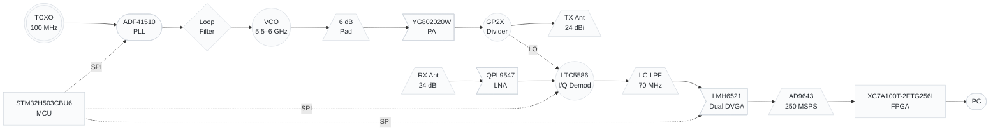
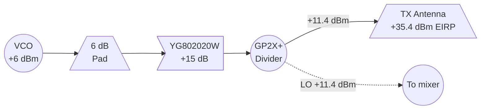
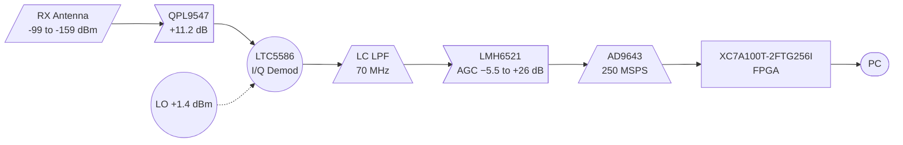
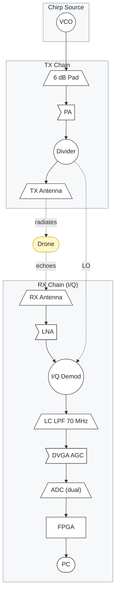

<p align="center">
  <h1 align="center">Lyrion Radar</h1>
  <p align="center">
    <strong>FMCW Radar for Counter-UAS (Drone Detection)</strong><br>
    5.5–6 GHz · I/Q demodulation · 30 cm range resolution · 1.5–3.5 km detection
  </p>
</p>

<p align="center">
  <a href="#what-is-it"></a>
  <a href="#key-features"></a>
  <a href="#link-budget"></a>
  <a href="#key-features"></a>
  <a href="#license"></a>
</p>

---

## Table of Contents

- [What is it?](#what-is-it)
- [Key Features](#key-features)
- [System Overview](#system-overview)
- [How it Works](#how-it-works)
- [Components](#components)
- [Signal Chain](#signal-chain)
- [Link Budget](#link-budget)
- [Chirp Modes](#chirp-modes)
- [Why PLL + FPGA?](#why-pll--fpga)
- [Design Decisions](#design-decisions)
- [Status & Roadmap](#status--roadmap)
- [Known Limitations](#known-limitations)
- [License](#license)

---

## What is it?

Lyrion Radar is a **Frequency-Modulated Continuous-Wave (FMCW) radar** designed to detect small drones (DJI Phantom class and larger). It uses a **fractional-N PLL for chirp generation**, a **Xilinx Artix-7 FPGA for real-time signal processing**, and a **14-bit 250 MSPS ADC** for IF digitization. Detection range is 1–3 km depending on the antenna and target size (see [Link Budget](#link-budget)).

The design is built around a **phase-locked loop** (not an open-loop DAC) for chirp coherence, and an **FPGA** (not a microcontroller) for the real-time DSP pipeline. This enables:

- **True coherent integration** across 64+ chirps (+18 dB SNR)
- **Micro-Doppler analysis** (drone rotor blade modulation at 100–500 Hz)
- **2D range-Doppler maps** in real-time
- **Deterministic latency** for tracking

---

## Key Features

| Feature | Specification |
|---------|---------------|
| **Frequency band** | 5.5 – 6.0 GHz (500 MHz sweep) |
| **Range resolution** | 30 cm |
| **Demodulation** | I/Q (complex) — LTC5586 |
| **Max range, 24 dBi (small drone, σ=0.01 m²)** | ~1.5 km |
| **Max range, 24 dBi (medium drone, σ=0.1 m²)** | ~2.3 km |
| **Max range, 27 dBi (small drone, σ=0.01 m²)** | ~2 km |
| **Chirp source** | ADF41510 fractional-N PLL (built-in ramp gen) |
| **Phase noise** | −231 dBc/Hz @ 100 kHz (fractional-N) |
| **RX LNA** | QPL9547: 0.3 dB NF, +11.2 dB @ 5.5 GHz, 39 dBm OIP3 |
| **AGC** | LMH6521 dual DVGA: 1400 MHz BW, 0.5 dB steps, SPI |
| **ADC** | AD9643 dual 14-bit, 250 MSPS (LVDS) |
| **DSP** | Xilinx XC7A100T-2FTG256I Artix-7 FPGA |
| **TX power** | +11.4 dBm (prototype 1) |
| **Antenna gain** | 21/24/27 dBi each (StarterDish™ UM) | TX and RX separate |
| **EIRP** | +35.4 dBm (3.5 W ERP) |
| **Scan rate** | 100 Hz – 10 kHz (configurable) |
| **BOM cost** | ~$250 (with Arty A7-100T dev board) |

---

## System Overview

The radar is organised into **four functional blocks**: a PLL-based chirp source, a TX chain, an RX chain, and digital processing.



**Shape legend** (standard RF block diagram conventions):

| Shape | Used for | Examples |
|-------|----------|----------|
| Trapezoid | Antenna, filter, pad | TX Ant, RX Ant, 6 dB pad, LC LPF |
| Flag/triangle | Amplifier | YG802020W PA, QPL9547 LNA, LMH6521 DVGA |
| Circle | Mixer, divider, VCO, I/Q demod | LTC5586 I/Q, GP2X+ divider, VCO, TCXO |
| Stadium | PLL, FPGA, MCU, PC | ADF41510, XC7A100T-2FTG256I, STM32H503CBU6, PC display |
| Diamond | Filter | Loop filter |
| Parallelogram | ADC | AD9643 |

### Block summary

| Block | Function | Key parts |
|-------|----------|-----------|
| **Chirp Source** | Generates a linear 5.5–6 GHz chirp | ADF41510 PLL, YSGM556006 VCO, 100 MHz TCXO, loop filter |
| **TX Chain** | Amplifies and transmits the chirp | YG802020W PA (+15 dB), GP2X+ divider, 24 dBi antenna |
| **RX Chain** | I/Q demodulation, filtering, AGC | QPL9547 LNA, LTC5586 I/Q demod, LC LPF 70 MHz, LMH6521 dual DVGA |
| **Digital Processing** | Digitises and processes I/Q signals | AD9643 dual ADC, XC7A100T-2FTG256I FPGA, STM32H503CBU6 MCU |

### Signal flow

1. The **PLL** generates a linear frequency ramp (5.5–6 GHz) locked to a TCXO reference.
2. The **VCO output** splits: one path goes to the TX chain (amplified and radiated), the other to the mixer as the local oscillator.
3. **Target echoes** enter the RX chain, are amplified by the LNA, and mixed with the LO to produce a low-frequency IF beat note.
4. The IF signal is filtered, amplified, and digitised by the **ADC** at 250 MSPS.
5. The **FPGA** runs the DSP pipeline: DDC → decimation → FFT → 2D range-Doppler → detection.
6. The **MCU** configures the PLL, AGC, and temp sensor via SPI/I²C, and relays data to the PC via UART/USB.

---

## How it Works

### FMCW Principle

The radar transmits a signal whose **frequency sweeps linearly over time** (a "chirp"). The signal reflects off a target and returns after a time delay `τ = 2R/c`. Mixing the received signal with the current transmit signal produces a **beat frequency** directly proportional to target range:

```
f_IF = (2 · B · R) / (c · T)
```

Where:
- **B** = sweep bandwidth (500 MHz)
- **R** = target range
- **c** = speed of light
- **T** = ramp time (1–10 ms)

An **FFT** of this beat signal reveals targets as distinct frequency peaks. A **triangular ramp** (up-chirp + down-chirp) extracts both range and velocity.

### Signal Flow

1. **PLL generates chirp** (5.5–6 GHz, linear ramp)
2. **TX chain** amplifies and splits the signal to the TX antenna and the mixer LO
3. **RX chain** amplifies echoes (LNA), I/Q demodulates (LTC5586), filters (LC LPF 70 MHz), applies AGC (LMH6521), and digitizes both I and Q (AD9643 dual channel)
4. **FPGA** processes the complex I/Q signal: DDC → decimate → FFT → 2D FFT → CFAR detection
5. **MCU** handles housekeeping: PLL config, LTC5586 SPI (DC null, RF atten), LMH6521 AGC, temperature, USB
6. **PC** displays the range-Doppler map and detected targets

---

## Components

### Chirp Source

| Part | Manufacturer | Role | Key Specs |
|------|-------------|------|-----------|
| **YSGM556006** | Innotion | VCO (in PLL loop) | 5320–6060 MHz, +6 dBm, 0–5 V tune |
| **ADF41510** | Analog Devices | Fractional-N PLL | 1–10 GHz, −231 dBc/Hz, built-in ramp gen |
| **TCXO 100 MHz** | ECS Inc | PLL reference | ±1 ppm, low phase noise |

### Analog Front-End

| Part | Manufacturer | Role | Key Specs |
|------|-------------|------|-----------|
| **YG802020W** | Innotion | TX driver | +15 dB gain, P1dB +16 dBm @ 5.5 GHz |
| **GP2X+** | Mini-Circuits | 2-way divider | 2.9–6.2 GHz, 3.6 dB loss, 20 dB isolation |
| **QPL9547TR7** | Qorvo | RX LNA | 0.3 dB NF, +11.2 dB gain @ 5.5 GHz (S21), 39 dBm OIP3 |
| **LTC5586IUKG#PBF** | ADI | I/Q demodulator | 300 MHz–6 GHz, diff I/Q out, SPI (DC null, 31 dB RF atten, image reject) |
| **LMH6521SQE/NOPB** | TI | Dual DVGA (AGC) | 1400 MHz BW, −5.5 to +26 dB, 0.5 dB steps, SPI, diff I/O |

### Digital Processing

| Part | Manufacturer | Role | Key Specs |
|------|-------------|------|-----------|
| **AD9643BCPZ-250** | ADI | ADC | Dual 14-bit, 250 MSPS, LVDS |
| **XC7A100T-2FTG256I** | Xilinx | FPGA | Artix-7, 101K logic cells, 240 DSP slices, 256-ball BGA, speed grade -2, industrial temp |
| **MT41K256M16TW-107** | Micron | DDR3L SDRAM | 256M × 16 = 512 MB |
| **STM32H503CBU6** | ST | Housekeeping MCU | Cortex-M33 @ 250 MHz, LQFP-48, USB |

> The **STM32H503CBU6** is the right fit for housekeeping: faster and more capable than the STM32G071, but not overkill like the STM32H723. It handles SPI to the PLL, SPI to the AGC, I²C to the temp sensor, GPIO to the FPGA, and USB for debugging. The LQFP-48 package is easy to hand-solder.

### Power

| Part | Manufacturer | Role | Key Specs |
|------|-------------|------|-----------|
| **ADP150AUJZ-5.0** | ADI | Ultra-low noise LDO | 5 V, <10 µVrms, for VCO |
| **LTM4644** | ADI | FPGA power module | Multi-rail DC/DC (1.0/1.8/3.3 V) |
| **LD1117S33** | ST | 3.3 V LDO | MCU, ADC digital |

### Antennas

The radar supports the **StarterDish™ UM** family of 5.5–6 GHz parabolic dish antennas. Three gain variants are available — pick based on your range vs. portability trade-off:

| Variant | Gain | Approx. dish size | Best for |
|---------|------|-------------------|----------|
| **StarterDish™ 21 UM** | 21 dBi | ~25 cm diameter | Portable, hand-held, short-range (≤ 500 m) |
| **StarterDish™ 24 UM** (default) | 24 dBi | ~30 cm diameter | Bench/test deployment, mid-range (1–1.5 km) |
| **StarterDish™ 27 UM** | 27 dBi | ~40 cm diameter | Fixed installation, long-range (2–3 km) |

**Trade-offs:**
- **Higher gain** = longer range, but **narrower beam** (~5° at 24 dBi, ~3° at 27 dBi) and bigger dish
- **Lower gain** = wider beam (~8° at 21 dBi, easier pointing), shorter range

| Item | Spec | Notes |
|------|------|-------|
| TX antenna | StarterDish™ 21/24/27 UM | Separate from RX, same model for both |
| RX antenna | StarterDish™ 21/24/27 UM | Pointed same direction as TX |
| Polarisation | Linear (H or V) | Match polarisation on both antennas |
| TX-RX isolation | 30–40 dB | With 1–2 m physical separation |

### Impact on Link Budget

The choice of antenna gain directly affects the maximum detection range. With 24 dBi (default), the radar reaches ~1 km for small drones (σ = 0.01 m²). With 27 dBi, the range extends to ~2 km for the same target.

See the [Link Budget](#link-budget) section for detailed numbers across all three antenna variants.

**Total BOM cost: ~$250** (including Arty A7-100T dev board, excluding antennas)

---

## Signal Chain

The signal chain is shown in three views: **TX path** (chirp → antenna), **RX path** (antenna → digital), and **Complete path** (TX + RX with the mixer connection between them).

### TX Path



### RX Path



### Complete Path (TX + RX)



**Visual conventions:**
- **Subgraph backgrounds** (`#f6f8fa`): Group boxes for each functional block, visible but not distracting
- **Shape fills** (`#fff` white): All RF components have a solid white background for text readability
- **Target/drone** (`#fff8c5` yellow): Highlighted to make the radar's purpose obvious
- **Arrows**: Solid for signal flow, dotted for RF radiation and control signals

---

## Link Budget

Conditions: TX power +11.4 dBm, system NF ~5.5 dB (QPL9547 + LTC5586 @ 5.8 GHz), noise floor −138.5 dBm per 1 kHz bin. SNR shown is with 64-chirp coherent integration (+18 dB). Radar equation verified in linear (see SPECS.md §8).

### Detection Range by Antenna Variant

| Antenna (each) | Beam width | Best for |
|----------------|-----------|----------|
| **StarterDish™ 21 UM** (21 dBi) | ~8° | Short range, portable |
| **StarterDish™ 24 UM** (24 dBi) | ~5° | Default — mid range |
| **StarterDish™ 27 UM** (27 dBi) | ~3° | Long range, fixed install |

### SNR Table — 24 dBi antennas (default)

| Range | σ = 0.01 m² (small drone) | σ = 0.1 m² (medium drone) | σ = 1 m² (large drone) |
|-------|------------------------------|------------------------------|--------------------------|
| 500 m | 29 dB ✅ | 39 dB ✅ | 49 dB ✅ |
| **1 km** | **17 dB ✅** | **27 dB ✅** | **37 dB ✅** |
| 1.5 km | 10 dB ⚠️ | 20 dB ✅ | 30 dB ✅ |
| 2 km | 5 dB ⚠️ | 15 dB ✅ | 25 dB ✅ |
| 3 km | — | 8 dB ⚠️ | 18 dB ✅ |

### SNR Table — 21 dBi antennas (portable, −6 dB vs 24 dBi)

| Range | σ = 0.01 m² (small drone) | σ = 0.1 m² (medium drone) | σ = 1 m² (large drone) |
|-------|------------------------------|------------------------------|--------------------------|
| 250 m | 35 dB ✅ | 45 dB ✅ | 55 dB ✅ |
| 500 m | 23 dB ✅ | 33 dB ✅ | 43 dB ✅ |
| 1 km | 11 dB ⚠️ | 21 dB ✅ | 31 dB ✅ |
| 1.5 km | 4 dB ⚠️ | 14 dB ✅ | 24 dB ✅ |

### SNR Table — 27 dBi antennas (long range, +6 dB vs 24 dBi)

| Range | σ = 0.01 m² (small drone) | σ = 0.1 m² (medium drone) | σ = 1 m² (large drone) |
|-------|------------------------------|------------------------------|--------------------------|
| 500 m | 35 dB ✅ | 45 dB ✅ | 55 dB ✅ |
| 1 km | 23 dB ✅ | 33 dB ✅ | 43 dB ✅ |
| 1.5 km | 16 dB ✅ | 26 dB ✅ | 36 dB ✅ |
| 2 km | 11 dB ⚠️ | 21 dB ✅ | 31 dB ✅ |
| 3 km | 4 dB ⚠️ | 14 dB ✅ | 24 dB ✅ |

**Key advantage:** The PLL + FPGA enables **true coherent integration** (+18 dB for 64 chirps) vs. the ~+9 dB noncoherent limit of an open-loop MCU approach. The I/Q architecture (LTC5586) adds Doppler direction discrimination and +37 dB image rejection.

> **Note**: These numbers use NF_sys = 5.5 dB (expected LTC5586 NF at 5.8 GHz). If measured NF is better (10 dB), add ~2.5 dB to all values. Adding a PA (MMG3H21NT1, +27 dBm) would add ~12 dB link margin, enabling 2-3 km small-drone detection with 24 dBi antennas.

---

## Chirp Modes

The radar supports four configurable modes, switchable via SPI to the ADF41510:

| Mode | Ramp time | Max range | Scan rate | v_max | Use case |
|------|-----------|-----------|-----------|-------|----------|
| **Search** | 10 ms | 1.5 km | 100 Hz | 0.6 m/s | Long-range detection |
| **Track** | 5 ms | 1.5 km | 200 Hz | 1.25 m/s | Following a detected target |
| **Fast** | 1 ms | 500 m | 1 kHz | 6.25 m/s | Close-range, high speed |
| **Micro-Doppler** | 0.1 ms | 50 m | 10 kHz | 62.5 m/s | Drone vs. bird discrimination |

**Micro-Doppler mode** is the key discriminator: at 10 kHz chirp PRF, the FPGA can resolve 100–500 Hz rotor blade modulation, which is unique to drones.

---

## Why PLL + FPGA?

For serious drone detection, you need phase coherence, micro-Doppler processing, and low phase noise. Only a PLL + FPGA architecture delivers all three.

| Requirement | Open-loop DAC + MCU | **PLL + FPGA (this design)** |
|-------------|--------------------|-----------------------|
| Phase noise | ~−80 dBc/Hz (free VCO) | **−231 dBc/Hz** (fractional-N) |
| Chirp coherence | Unproven | **Proven** (PLL locks to TCXO) |
| Coherent integration | +9 dB (noncoherent) | **+18 dB** (coherent) |
| Demodulation | Real (single mixer) | **I/Q complex** (LTC5586) |
| Doppler direction | Ambiguous | **Resolved** (I/Q phase) |
| Image rejection | None | **+37 dB** (LTC5586, adj. to 60 dB) |
| Micro-Doppler | Infeasible | **Trivial** (10 kHz PRF mode) |
| 2D range-Doppler | Slow (software) | **< 100 µs** (hardware FFT) |
| Temperature stability | Needs compensation | **Eliminated** (PLL locks) |
| Range (small drone) | ~1 km | **~1.5 km** |

---

## Design Decisions

### 1. ADF41510 PLL (not open-loop DAC)

The open-loop DAC approach was simpler but had critical limitations: VCO phase noise masks small targets, chirp coherence was unproven, and temperature drift needed active compensation. The ADF41510 solves all of these with a built-in ramp generator, ultra-low phase noise, and PLL locking to a stable TCXO reference.

### 2. XC7A100T-2FTG256I FPGA (not MCU)

A microcontroller can do basic range FFT in ~50 µs, but cannot do real-time coherent integration, micro-Doppler, or 2D range-Doppler processing. The XC7A100T-2FTG256I runs FFTs in < 1 µs in hardware, with deterministic latency.

### 3. AD9643 at 250 MSPS (dual channel, I/Q)

250 MSPS provides ample oversampling for the FPGA's DDC + decimation pipeline. Both channels are used: CH A = I, CH B = Q. The dual-channel architecture enables complex (I/Q) signal processing for Doppler direction discrimination and image rejection.

### 4. YSGM556006 as PLL VCO

The VCO you already own is reused as the VCO in the PLL loop. The ADF41510 doesn't have an integrated VCO, so this is a natural fit.

### 5. STM32H503CBU6 for housekeeping (not G071, not H723)

The G071 would technically work for housekeeping, but the H503 gives more headroom for future features at low cost. The H723 is overkill — those are reserved for other projects.

### 6. StarterDish™ UM antennas, separate TX/RX

Separate TX and RX antennas (no circulator) provide better isolation than a single antenna + circulator. The [StarterDish™ UM](#antennas) family offers three gain variants (21/24/27 dBi) — pick the one that matches your deployment. For prototype 1, **24 dBi** is the default balance between range and portability. **27 dBi** gives ~6 dB more link margin (extends small-drone range to ~2 km) but requires more accurate pointing due to the narrower beam.

### 7. LTC5586 I/Q demodulator (not discrete mixer)

The LTC5586 integrates two mixers + 90° LO hybrid + IF amplifiers in one 5×5 mm QFN. It provides: SPI-controlled DC offset null (critical for FMCW TX leakage), 31 dB RF attenuator (close-target AGC), adjustable image rejection (to 60 dB), and differential I/Q outputs that drive the LMH6521 directly. A discrete solution (2× YX18 + 90° hybrid + baluns) would cost more, use more board space, and lack DC nulling.

**UNVERIFIED**: LTC5586 specs are at 1.9 GHz. Performance at 5.8 GHz (top of its 6 GHz range) must be measured on prototype 1.

### 8. LMH6521 DVGA (not MCP6S91)

The MCP6S91 had 18 MHz gain-bandwidth product — at ×8 gain, bandwidth collapsed to 2.25 MHz, making it useless at radar IF frequencies (3–67 MHz). The LMH6521 maintains 1400 MHz bandwidth at ALL gain settings (−5.5 to +26 dB, 0.5 dB steps). It's a dual-channel part, naturally handling I and Q. SPI-controlled from the FPGA for closed-loop AGC.

### 9. LC LPF at 70 MHz (not RC at 4.8 MHz)

The old 4.8 MHz first-order RC filter limited detection range to 1.4 km at 1 kHz chirp rate. The new 3rd-order LC Butterworth at 70 MHz passes the full IF bandwidth (up to 2 km at 10 kHz chirp rate) with −60 dB/decade rolloff for proper anti-aliasing. Passive (zero noise), 6 components, $0.05.

### 10. No power amplifier (prototype 1)

The YG802020W delivers +15 dBm, which combined with 24 dBi antennas and coherent integration reaches ~1.5 km for small drones (~2 km with 27 dBi). A PA upgrade (MMG3H21NT1, +27 dBm) is a future revision that would add ~12 dB link margin, enabling 2-3 km small drone detection with 24 dBi antennas.

---

## Status & Roadmap

| Phase | Status |
|-------|--------|
| Architecture definition | ✅ Done |
| Component selection | ✅ Done |
| Link budget validation | ✅ Done |
| Loop filter design (ADIsimPLL) | ⬜ Pending |
| Hardware bring-up (PLL + TX/RX) | ⬜ Pending |
| VCO/PLL calibration | ⬜ Pending |
| FPGA firmware (VHDL/Verilog) | ⬜ Pending |
| MCU firmware (STM32H503CBU6) | ⬜ Pending |
| ADC interface (LVDS) | ⬜ Pending |
| DSP pipeline (DDC → FFT → CFAR) | ⬜ Pending |
| Integration + drone flight test | ⬜ Pending |

---

## Known Limitations

| Issue | Status |
|-------|--------|
| **+35 dBm EIRP at 5.5–6 GHz is not ISM** | Requires licensed or experimental authorization in most jurisdictions |
| **LTC5586 performance at 5.8 GHz unverified** | Datasheet specs at 1.9 GHz only. 5.8 GHz is top of its 6 GHz range. Measure gain, NF, I/Q balance on prototype. |
| **QPL9547 NF at 5.5 GHz** | Datasheet 0.3 dB @ 1.9 GHz; S-params show 11.2 dB gain @ 5.5 GHz. NF at 5.5 GHz estimated ~1 dB. |
| **System NF = 5.5 dB (expected)** | Dominated by LTC5586 NF / LNA gain. If LTC5586 NF > 20 dB at 5.8 GHz, add THS4509RGTT rescue gain stage. |
| **PLL loop BW vs chirp rate** | Loop BW must be > 10× chirp rate. Need programmable filter for different modes. |
| **Fractional-N spurs** | Spurs at PFD/2 offsets. Use dithering mode to reduce. |
| **FR4 at 5.5–6 GHz** | Higher loss than at lower frequencies. Acceptable for prototype; use Rogers for production. |
| **Micro-Doppler at long range** | 10 kHz PRF limits max unambiguous range to 50 m. Use only for close-range classification. |
| **LO overdrive to LTC5586** | GP2X+ outputs +11.4 dBm; LTC5586 needs ~0 dBm. 10 dB attenuator pad required. |

---

## License

MIT License — see [LICENSE](LICENSE) for details.

Copyright (c) 2026 Oliver Zoller
